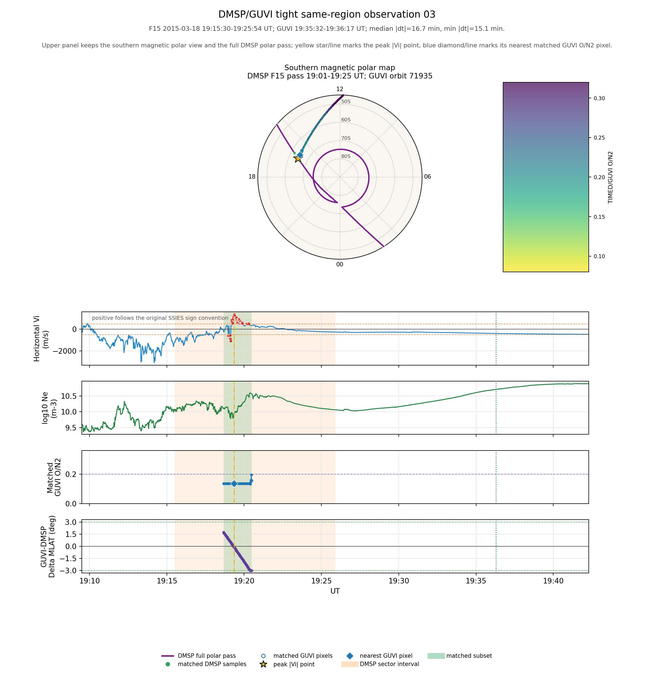
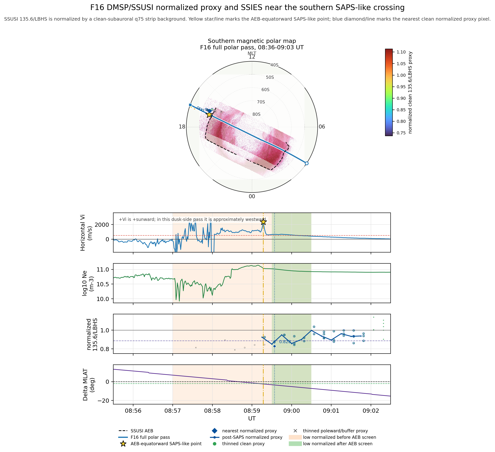

# SAPS–O/N2 项目进展与证据状态

**核对日期：** 2026-09-08

**最新本地科学产物：** 2026-07-12

**本次 GitHub 更新性质：** 整理与归档现有结果；没有新增科学计算或重新运行门控。

## 1. 当前结论

2015 St. Patrick 风暴南半球观测显示，SAPS搜索扇区内较强水平离子漂移与较低 TIMED/GUVI O/N2 存在多次近时空共现。2015-03-17 08:59 UT 的 F16 旗舰个例还具有同轨、近同时的 DMSP/SSUSI 相对 O/N2-sensitive radiance-ratio proxy 降低迹象。

现有结果支持“与 SAPS 相关的热层成分扰动”假设，但尚不能证明 SAPS 导致 O/N2 降低。当前阶段应概括为：

> 单次风暴的观测候选关联已经形成；正式 SAPS 判定、多事件统计和因果机制闭环尚未完成。

## 2. 科学问题与证据链

项目目标是检验 SAPS 是否与热层 O/N2 变化存在稳定关系，并进一步判断可能的动力学、化学和光学后果。

采用的证据顺序为：

> 观测约束 → 模拟成分响应 → 分子/原子化学 → 光学后果

当前仓库只推进到第一层“观测约束”。这里没有 TIEGCM 的 O、O2、N2 组分预算、输运倾向项或边界通量，也没有 GLOW 的反应生产/损失项和 630.0/557.7 nm 发光诊断。

## 3. 已完成且可复核的工作

### 3.1 数据与流程框架

- 建立了 2011–2015 年的737条风暴相位–日期分析记录，来自225个风暴组和412个唯一日历日期。
- 建立了 Batch-1 强风暴子集：129行、22个风暴组和123个唯一日历日期。
- 准备了 Batch-1 Top-5 数据获取试点，但尚未开始正式 Batch-1 科学统计；当前 Batch-1 的 `science_ready` 和正式匹配数均为0。
- 建立了 GUVI、DMSP SSIES、SuperDARN、SSUSI 和地磁指数的数据清单、标准化状态、下载队列和阻塞表。
- 实现了事件筛选、DMSP SAPS-like crossing 检测、O/N2 opportunity 构建、时空匹配、候选分级、对照区字段、阈值敏感性和图件生成流程。

737行分析记录的公开快照见 [`event_universe_expanded_2011_2015.csv`](../data_samples/progress_snapshot_20260908/event_universe_expanded_2011_2015.csv)。Batch-1及优先级表见仓库既有文件。

### 3.2 2015 St. Patrick 风暴的观测机会筛选

在 `|AACGM MLAT| = 45–80 deg`、`MLT = 12–18 h`、`|dMLAT| <= 3 deg`、`|dMLT| <= 0.5 h` 且每段至少10个 matched DMSP样本的 source-first 筛选中，时间容差收紧后的候选数为：

| 最大时间容差 | 候选窗口 | 北半球 | 南半球 |
|---:|---:|---:|---:|
| 3 h | 29 | 0 | 29 |
| 2 h | 20 | 0 | 20 |
| 1 h | 11 | 0 | 11 |
| 0.5 h | 9 | 0 | 9 |

这些是嵌套重筛的候选行，不能相加，也不是独立风暴数。北半球为0的原因是当前 GUVI dayglow O/N2 在相同半球、MLT和时间条件下没有可用观测机会，而不是“北半球没有SAPS”。原始容差表见 [`dmsp_guvi_time_tolerance_summary.csv`](../data_samples/progress_snapshot_20260908/dmsp_guvi_time_tolerance_summary.csv)，0.5 h的全部9个候选见 [`dmsp_guvi_candidates_le_0p5h.csv`](../data_samples/progress_snapshot_20260908/dmsp_guvi_candidates_le_0p5h.csv)，南北半球观测机会与3 h筛选明细见 [`event_20150317_hemisphere_observation_summary.md`](../summaries/screening_outputs/event_20150317_hemisphere_observation_summary.md)。

### 3.3 五个紧时间 DMSP–GUVI 图件候选

在9个 `<= 0.5 h` 候选中，作图脚本按以下条件选出5个窗口：

```text
|Vi| p95 >= 0.5 km/s
AND
(GUVI O/N2 median <= 0.20 OR GUVI O/N2 p05 <= 0.15)
```

这5个窗口的范围为：

- DMSP–GUVI 时间差中位数：2.53–25.85 min；
- GUVI O/N2 中位数：0.137–0.184；
- DMSP `|Vi|` p95：0.587–1.288 km/s；
- matched DMSP样本数：28–131。

必须注意：这5个窗口全为F15，来自同一次风暴，不是5个独立事件；筛选量是水平漂移绝对值，其中2015-03-17 14:28窗口的signed median为−1.0125 km/s且positive fraction为0。因此它们统一记为“强水平漂移–低 GUVI O/N2 tight候选”，不能写成“5个西向SAPS”或“5个已确认SAPS”。净化后的5窗口表见 [`tight_dmsp_guvi_figure_summary.csv`](../data_samples/progress_snapshot_20260908/tight_dmsp_guvi_figure_summary.csv)。

代表性图件位于 [`figures/progress_snapshot_20260908/`](../figures/progress_snapshot_20260908/)。这些图保留 DMSP全极区过境、漂移、电子密度、匹配的 GUVI O/N2及位置偏差，用于逐例审计，而非代替 SAPS detector gate。



### 3.4 08:59 UT DMSP/SSUSI 旗舰个例

这是一个独立的F16 SSIES–SSUSI个例，不属于上述5个F15 tight DMSP–GUVI窗口。F16在2015-03-17 08:59:17 UT的南半球穿越中给出：

- MLAT：−56.10 deg；
- MLT：16.92 h；
- 存储的水平离子漂移：+2.366 km/s；
- 相对 SSUSI极光赤道侧边界：约赤道侧2.46 deg MLAT。

最近的 AEB-screened clean SSUSI像元位于08:59:34 UT，仅晚17 s：

- 原始 `135.6/LBHS`：0.9793；
- 同 rev、同半球、同 cross-track 的 clean-subauroral q75背景：1.1822；
- 归一化 proxy：0.8284；
- 相对背景降低量：0.1716，即约17.2%。

该像元还满足 AEB赤道侧超过2 deg、附近LBHS低于极光污染阈值、SZA不超过75 deg及分母有效性条件；但SZA为74.952 deg，紧贴当前75 deg质量上限。结果见 [`f16_normalized_proxy_0900_summary.csv`](../data_samples/progress_snapshot_20260908/f16_normalized_proxy_0900_summary.csv) 和 [`f16_normalized_proxy_method_note.md`](../data_samples/progress_snapshot_20260908/f16_normalized_proxy_method_note.md)。

这个量是经筛选和背景归一化的相对 O/N2-sensitive FUV radiance-ratio proxy，不是官方柱O/N2。相同窗口的官方 SSUSI ON2共有23行，但正值行数为0，见 [`f16_ssusi_official_on2_0900_summary.csv`](../data_samples/progress_snapshot_20260908/f16_ssusi_official_on2_0900_summary.csv)。不能把0.9793或0.8284与GUVI/GOLD官方绝对O/N2直接比较。详细方法边界见 [`SSUSI proxy可用性报告`](../summaries/ssusi_on2_proxy_usability_report_20150317_f16.md)。



### 3.5 同卫星同过境 SSUSI 分支与联合图件

- 已生成5个 DMSP–SSUSI同卫星同过境筛选页；净化摘要见 [`samepass_ssusi_guvi_summary.csv`](../data_samples/progress_snapshot_20260908/samepass_ssusi_guvi_summary.csv)。
- 其中只有2个窗口满足上述作图级“较强漂移+低O/N2”条件，而且这两例的DMSP–GUVI中位时间差约为115–119 min。
- 因此 `same pass` 只指DMSP–SSUSI；不能误写为DMSP、SSUSI、GUVI三者严格同时同轨。
- 已在本地生成6个重点区域叠加图和6个重点窗口SSIES时序图。它们用于综合查看GUVI swath、DMSP crossing、SSUSI auroral context与SuperDARN quick-look，但未整包上传，以避免重复大文件和机器路径信息。

## 4. 烟雾测试与当前数字的对应关系

项目不同阶段使用了不同事件拆分和时间阈值，因此以下数字不能混为同一统计样本：

| 阶段 | 数字 | 正确解释 |
|---|---:|---|
| 3 h source-first筛选 | 29窗口，其中14个满足简单强漂移/低O/N2筛选 | 单次风暴的宽时间候选 |
| 结构化本地流程烟雾测试 | 26窗口；B级11、C级15、无Grade A | 验证流程能生成结果，等级不是科学置信度 |
| 0.5 h时间容差 | 9窗口 | 更严格的近时间候选全集 |
| tight图件选择 | 5窗口 | 按绝对漂移与低O/N2条件选出的展示/审计子集 |
| Seed matching V2 | 25个1–3 h行 | 全部 `recommended_for_statistics = False` |

GOLD分支仍为空表，只保留未来接口；没有混入GUVI统计。

## 5. 当前可以和不能声称的结论

### 可以表述

- 单次2015 St. Patrick风暴南半球存在强水平离子漂移与较低GUVI O/N2的重复近时空共现。
- 08:59 UT个例具有近同时、同轨的SSUSI相对O/N2-sensitive proxy降低迹象。
- 现有观测与“与SAPS相关的热层成分扰动”假设一致。
- 现有代码、数据清单和门控产物为后续多事件研究建立了工程框架。

### 不能表述

- 已证明SAPS导致O/N2降低；
- 已确认5个独立SAPS事件；
- 已获得2011–2015年、跨风暴或南北半球统计规律；
- SSUSI `135.6/LBHS` proxy是官方绝对O/N2；
- SuperDARN quick-look已提供定量SAPS通道速度或T-slope；
- 已完成TIEGCM动力学归因、化学反应诊断或GLOW发光机制闭环。

在西向分量/符号、轨道几何、持续性、形态和AEB位置完成审计前，统一使用 `SAPS-like candidate` 或“SAPS-like漂移候选”。

## 6. 门控与阻塞

### 6.1 Normalizer V3（2026-06-30快照）

415个门控行的状态为：

| 允许范围 | 行数 |
|---|---:|
| `science_ready` | 21 |
| `smoke_test_only` | 382 |
| `blocked` | 12 |

21个 `science_ready` 行全部属于地磁指数。GUVI、DMSP、SuperDARN和SSUSI目前没有可直接进入最终多事件统计的完整通过行。7月新增图件没有重新运行或改变该V3状态。主要门控缺口为：

- DMSP缺必要变量：25行；
- GUVI无有效日辉或O/N2：7行；
- SuperDARN缺定量产品：101行；
- SSUSI边界/污染状态未物化：249行；
- 下载或链接阻塞：12行。

权威状态表见 [`normalizer_v3_gate_decision_table.md`](../summaries/screening_outputs/normalizer_v3_gate_decision_table.md)。

### 6.2 三个验证事件

2014-02-19、2011-10-25和2013-06-30各缺GUVI、DMSP、定量SuperDARN与SSUSI，共12项仪器数据阻塞。其中6项需要认证访问，6项需要人工下载。这些属于数据获取/链接阻塞，不是detector failure，也不能记为科学nonmatch。

详见 [`validation_event_instrument_blocker_resolution.md`](../summaries/screening_outputs/validation_event_instrument_blocker_resolution.md)。

## 7. 下一步与晋级条件

### P0：正式审计旗舰个例和5个tight窗口

逐例确认有符号西向漂移分量与符号约定、轨道相对极光边界的几何、漂移增强的持续时间/宽度/形态、离子密度槽等辅助特征以及定量SuperDARN流场支持。

**晋级条件：** 每个候选具有可追踪的方向、几何、边界和形态字段；未通过者保留为候选。

### P1：建立可解释的O/N2对照

增加同过境/同SZA、同MLT、AEB-relative赤道侧/通道内/极向侧以及安静日或风暴前背景，报告O/N2异常量、背景选择和不确定度。

**晋级条件：** 能区分局地SAPS相关异常、风暴全球背景和观测几何效应。

### P2：补齐三个验证事件并通过V3

获取并解析GUVI、DMSP、SuperDARN和SSUSI文件，重新运行：

> reconciliation → normalizer V3 → detector → matching

**晋级条件：** 仪器行进入 `science_ready`，而不是仅从 `blocked` 变为“文件存在”。

### P3：先Top-5，再Batch-1

先完成5个风暴组的acquisition pilot；通过门控后扩展至129行Batch-1；仅在数据覆盖、nonmatch和选择函数可接受时，再扩至737行分析记录。

### P4：最后推进因果机制链

观测结论稳定后，再增加TIEGCM的O/O2/N2、温度、风场、组分倾向项和边界通量，以及GLOW的物种反应率和630.0/557.7 nm源项诊断。在这些诊断出现前，不把观测共现升级为动力学、化学或光学因果机制。

## 8. 给网页版ChatGPT的讨论入口

建议先让网页版ChatGPT阅读本报告、证据快照和两份门控报告，再重点讨论：

1. 5个tight窗口中，哪些能通过正式SAPS判定，哪些只能保留为增强漂移候选？
2. 如何构建同时控制SZA、MLT、AEB-relative位置和风暴背景的GUVI O/N2反事实样本？
3. Top-5试点需要多少有效风暴、对照区和南北半球覆盖，才能决定是否扩展至Batch-1？
4. 后续TIEGCM应保存哪些组分倾向项，才能区分垂直输运、水平输运、扩散和化学？
5. 如何把SSUSI proxy用作辅助证据，同时避免与GUVI官方柱O/N2绝对值直接比较？

可直接使用下面的讨论提示：

> 请先阅读 `reports/SAPS_ON2_CURRENT_PROGRESS_20260908.md` 及其中链接的证据文件。请严格区分SAPS-like候选、正式SAPS判定、观测共现、多事件统计和因果机制。首先审查5个tight窗口的判定充分性，然后设计O/N2反事实控制与Top-5晋级门槛；不要把SSUSI radiance-ratio proxy当作官方绝对O/N2，也不要把SuperDARN quick-look当作定量流场。

## 9. 推荐阅读顺序

1. 本报告；
2. [`dmsp_guvi_time_tolerance_summary.csv`](../data_samples/progress_snapshot_20260908/dmsp_guvi_time_tolerance_summary.csv)；
3. [`tight_dmsp_guvi_figure_summary.csv`](../data_samples/progress_snapshot_20260908/tight_dmsp_guvi_figure_summary.csv)及对应图件；
4. [`f16_normalized_proxy_method_note.md`](../data_samples/progress_snapshot_20260908/f16_normalized_proxy_method_note.md)；
5. [`SSUSI proxy可用性报告`](../summaries/ssusi_on2_proxy_usability_report_20150317_f16.md)；
6. [`normalizer_v3_gate_decision_table.md`](../summaries/screening_outputs/normalizer_v3_gate_decision_table.md)；
7. [`validation_event_instrument_blocker_resolution.md`](../summaries/screening_outputs/validation_event_instrument_blocker_resolution.md)。

## 10. Provenance

本报告中的数字来自对应的CSV/Markdown快照。大体积原始卫星数据、缓存、本机绝对路径、重复中间图件和未公开稿件未上传。`docs_index/progress_snapshot_manifest_20260908.csv`记录本次新增证据文件的来源、大小和SHA256。
